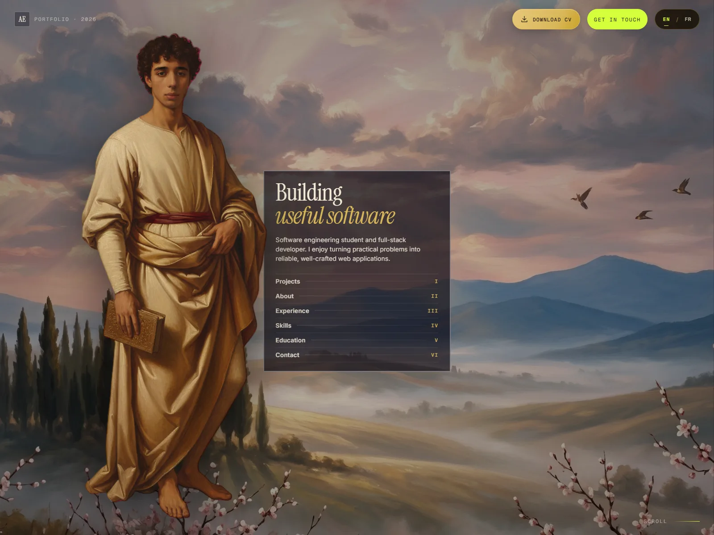

# Achraf El Allali — Portfolio

Personal portfolio for Achraf El Allali, a software engineering student at ISIMA and full-stack developer based in Clermont-Ferrand, France.



## Highlights

- Personal introduction, experience, education, skills, projects, and contact details
- Seven featured projects, including this portfolio, with screenshots and GitHub links
- Complete English/French interface, with a language preference preserved across navigation and reloads
- Painting-inspired visual identity: serif typography, gold frames, and scroll-driven scenes
- Responsive project gallery with lazy-loaded WebP images and Roman-numeral fallbacks
- Keyboard focus states, bilingual image descriptions, and reduced-motion support
- Visible CV download and LinkedIn profile links on desktop and mobile
- Static deployment with a mailto-based contact form—no backend required; messages are sent through the visitor's email application

## Built with

- **React** — reusable sections and shared language state via Context
- **Vite** — local development and static production builds
- **Framer Motion** — section reveals and scroll-driven animation
- **Lenis** — smooth scrolling when reduced motion is not requested
- **CSS** — shared design tokens, responsive layouts, and hover/focus interactions

The EN/FR content is bundled locally; no translation service or additional runtime
library is needed. The contact form does not store submissions or send email itself.

## Run locally

Use Node.js **22.12 or newer** and npm. The deployment workflow uses Node.js 22.

```bash
npm ci
npm run dev
```

Then open the local address Vite prints in the terminal.

## Check the code

```bash
npm run lint
npm run build
```

## Build for deployment

```bash
npm run build
npm run preview
```

The production files are generated in `dist/` and can be deployed to any static host, including Vercel, Netlify, and GitHub Pages.

The included [GitHub Pages workflow](.github/workflows/deploy.yml) builds and deploys
on pushes to `main`, or when started manually. Vite currently uses a root URL base
(`/`); adjust `base` in `vite.config.js` before deploying under a repository subpath.

## Language and image customization

Use the **EN / FR** controls in the header or footer. A valid `?lang=en` or `?lang=fr`
parameter takes precedence over the saved `portfolio-language` preference in
localStorage; otherwise the default is English. Switching updates the page without
reloading or losing a contact-form draft.

Project images live in `public/assets/marginalia/projects/`. For a replacement,
prefer **1600 × 1200 (4:3), WebP**, without upscaling a smaller original. Update the
matching image path, intrinsic dimensions, and English/French alt text in
`src/marginalia/data/works.js`. Missing or failed images display the original numbered
fallback in the same reserved space. The screenshot above is also the portfolio's
project image: `public/assets/marginalia/projects/portfolio.webp`.

## Main content locations

See [the image and EN/FR guide](docs/portfolio-updates.md) for exact image paths,
recommended dimensions, source credits, language behavior, and related design changes.

- `src/marginalia/config.jsx` — identity, section copy, and metadata
- `src/marginalia/data/works.js` — featured projects
- `src/marginalia/data/writings.js` — professional experience
- `src/marginalia/data/stack.js` — skills and technologies
- `src/marginalia/data/press.js` — education, training, and profile links
- `src/marginalia/data/socials.js` — contact and social links
- `src/marginalia/i18n/content.jsx` — French translations and shared EN/FR interface text
- `public/assets/marginalia/projects/` — seven optimized project images

## Contact

- GitHub: [H-raf0](https://github.com/H-raf0)
- LinkedIn: [achraf-el-allali](https://www.linkedin.com/in/achraf-el-allali)
- Email: [achrafelallali123@gmail.com](mailto:achrafelallali123@gmail.com)
